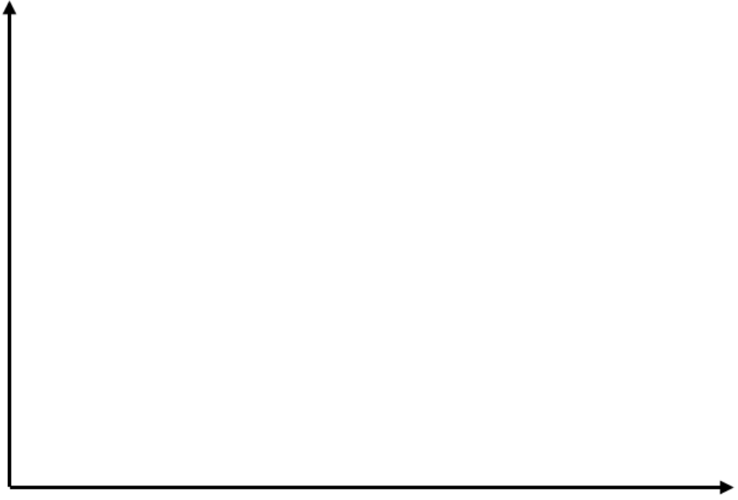

# Coming-Out-Gruppe für FLINTA[^2] 2024
# Meine persönliche Coming-Out-Geschichte

Dieses Arbeitsblatt soll Dir eine Hilfestellung dabei sein, Dich vor allem mit Deiner sexuellen/romantischen Orientierung gedanklich zu
beschäftigen. 
In den kommenden Sitzungen werden wir uns Zeit nehmen, die persönlichen Geschichten der einzelnen Personen
kennen zu lernen.  
Mit Coming-Out–Geschichte ist dabei **nicht** gemeint, dass Du bereits mit anderen über deine
Gefühle für Menschen gesprochen haben musst, die nicht der Erwartung entsprechen, dass Frauen nur Männer lieben und umgekehrt.  
Hierzu zählen vielmehr auch persönliche Erlebnisse, Erkenntnisse, Begegnungen mit bestimmten
Menschen oder mögliche Schlüsselerlebnisse im Laufe des eigenen Lebens, die mit diesen Gefühlen in
Zusammenhang stehen. 
Du kannst dazu entweder nur Teil I oder Teil II nutzen oder beide Teile.
Suche Dir einen Ort, an dem Du nicht gestört werden kannst, und nimm Dir ausreichend Zeit und Ruhe! :smile:

## Teil 1

Stelle Deine Coming-Out-Geschichte graphisch/bildlich dar. Hier kannst Du Dich der Mittel bedienen, die Dir gerade in
den Sinn kommen (z. B. kleine Bildchen, Symbole, kurze Texte, ein Comic, bunte Farben, Muster etc. ). Wenn Du
magst, kannst Du auch den unten stehenden Zahlenstrahl (eine oder beide Achsen) nutzen und für Dich z.B. als
biographische Zeitachse Deines Lebens oder was auch immer für Dich passend ist beschriften.

## Teil 2

>Beantworte alle Fragen, die Du gerne beantworten möchtest. Du kannst für einzelne Antworten auch zusätzlich die
>Rückseite nutzen

- Wann hast du zum ersten Mal Gefühle für jemanden empfunden, die von den gesellschaftlichen Erwartungen an dich abwichen? 
>____________________________________________________________________________________________________________ 
>____________________________________________________________________________________________________________
>____________________________________________________________________________________________________________
- Was haben diese Gefühle mit Dir gemacht? Wie hast Du reagiert?
>____________________________________________________________________________________________________________ 
>____________________________________________________________________________________________________________
>____________________________________________________________________________________________________________ 
- Welche Assoziationen kommen Dir bei der Bezeichnung schwul, lesbisch, bisexuell oder pansexuell in den Sinn?
>____________________________________________________________________________________________________________ 
>____________________________________________________________________________________________________________
>____________________________________________________________________________________________________________
- Gibt es andere Begriffe, mit denen du dich in letzter Zeit in Bezug auf deine Sexualität auseinandersetzt?
>____________________________________________________________________________________________________________ 
>____________________________________________________________________________________________________________
>____________________________________________________________________________________________________________
- Kennst Du Menschen, die offen schwul, lesbisch, bi, pan oder in anderer Weise queer[^3] leben? Wie stehst Du zu diesen
Personen?
>____________________________________________________________________________________________________________ 
>____________________________________________________________________________________________________________
>____________________________________________________________________________________________________________
- Was wünschst Du Dir bzgl. Deiner romantischen und sexuellen Gefühle?
>____________________________________________________________________________________________________________ 
>____________________________________________________________________________________________________________
>____________________________________________________________________________________________________________

Am heutigen Tag ordne ich meine sexuelle und/oder romantische Orientierung auf der Grafik folgendermaßen ein (markiere einen Punkt pro Linie):
| | | | | |
| --- | --- | --- | --- | ---- |
| Zum **weiblichen** Geschlecht: | 
|  | **romantisch** | wenig | _____________________________________________________________ | stark |
|  | **sexuell** | wenig | _____________________________________________________________ | stark |
| Zum **männlichen** Geschlecht: |
|  | **romantisch** | wenig | ______________________________________________________________| stark |
|  | **sexuell** | wenig | _____________________________________________________________ | stark |
| Zu **nichtbinären** [^1] Personen: |
|  | **romantisch** | wenig | _____________________________________________________________ | stark |
|  | **sexuell** | wenig | _____________________________________________________________ | stark |

- Gab es bereits Menschen, die deine Gefühle erwidert haben?
>____________________________________________________________________________________________________________ 
>____________________________________________________________________________________________________________
>____________________________________________________________________________________________________________
- Nenne einige Adjektive, die Deine Gefühle und Erlebnisse mit Menschen eines Geschlechts beschreiben, zu dem du dich nicht oder vermutlich weniger hingezogen fühlst als erwartet.
>____________________________________________________________________________________________________________ 
>____________________________________________________________________________________________________________
>____________________________________________________________________________________________________________
- Wie ist/war die Einstellung Deiner Eltern gegenüber Menschen die queer[^3] leben?
>____________________________________________________________________________________________________________ 
>____________________________________________________________________________________________________________
>____________________________________________________________________________________________________________
- Hast du das Gefühl, dass die Erwartungen deiner Familie oder deines Umfeldes deine Selbstwahrnehmung beeinflusst haben?
>____________________________________________________________________________________________________________ 
>____________________________________________________________________________________________________________
>____________________________________________________________________________________________________________
- Hast du schon mal mit jemandem über deine Gefühle in Bezug auf deine Identität gesprochen oder sie angedeutet? 
Wenn ja, wie haben die Personen reagiert?
>____________________________________________________________________________________________________________ 
>____________________________________________________________________________________________________________
>____________________________________________________________________________________________________________
- Wem würdest Du gerne (noch) davon erzählen? Warum? Was erhoffst Du Dir davon?
>____________________________________________________________________________________________________________ 
>____________________________________________________________________________________________________________
>____________________________________________________________________________________________________________
- Welche Medien, Veranstaltungen, Angebote, Filme, Bücher, etc. hast Du bereits kennengelernt und genutzt,
um Dich zu informieren? Wie hilfreich/weniger hilfreich war das?
>____________________________________________________________________________________________________________ 
>____________________________________________________________________________________________________________
>____________________________________________________________________________________________________________ 
- Fühlst du dich gefestigt in deiner Identität, und/oder gibt es Aspekte, die du noch erkunden möchtest?
>____________________________________________________________________________________________________________ 
>____________________________________________________________________________________________________________
>____________________________________________________________________________________________________________
- Was erhoffst Du Dir für Deine persönliche Entwicklung oder Deine jetzige Situation von Deiner Teilnahme an
der Gruppe?
>____________________________________________________________________________________________________________ 
>____________________________________________________________________________________________________________
>____________________________________________________________________________________________________________
- **Worauf freust du dich?**
>____________________________________________________________________________________________________________ 
>____________________________________________________________________________________________________________
>____________________________________________________________________________________________________________
[^1]: **Nichtbinär**, manchmal auch non-binär oder wie im Englischen nonbinary, ist ein Überbegriff für alle Menschen, die weder männlich noch weiblich sind. Sie können sich z.B. zwischen diesen beiden Geschlechtern verorten, oder ganz außerhalb davon, oder auch gar kein Geschlecht haben (**agender**). Manche nichtbinäre Menschen sind auch gleichzeitig männlich und weiblich (**bigender**) oder haben eine Geschlechtsidentität, die sich immer wieder ändert (**genderfluid**).  Andere stellen sich gegen das binäre Geschlechtersystem und haben ein Geschlecht, das nichts mit Männlichkeit und Weiblichkeit zu tun hat (**genderqueer**). (Quelle: https://queer-lexikon.net/uebersichtsseiten/trans/)

[^2]: **FLINTA**, Akronym für **F**rauen, **L**esben, **I**nter-, **N**ichtbinäre-, **T**rans-, und **A**geschtlechiche Personen. 

[^3]: **Queer**, kann als Überbegriff für Menschen benutzt werden, die nicht in die romantischen, sexuellen und/oder geschlechtlichen Normen der Gesellschaft passen. Oft wird es als offenere Variante zu LSBT+ verwendet. (Quelle: https://queer-lexikon.net/2017/06/08/queer/) 
